# Etterlevelse – UML Architecture & Domain Model

**Date created:** 26 March 2026
**Last updated:** 15 April 2026

---

## Table of Contents

1. [How to view Mermaid diagrams in VS Code](#how-to-view-mermaid-diagrams-in-vs-code)
2. [System Architecture](#system-architecture)
3. [System Architecture Overview](#system-architecture-overview)
4. [Domain Model (Class Diagram)](#domain-model-class-diagram)
5. [API Endpoint Overview](#api-endpoint-overview)
6. [EtterlevelseDokumentasjon Status State Machine](#etterlevelsedokumentasjon-status-state-machine)
7. [PVK/PVO Status State Machine](#pvkpvo-status-state-machine)
8. [Action Menu Button State Machines](#action-menu-button-state-machines)
9. [Dashboard Traffic Light Colors](#dashboard-traffic-light-colors)
10. [Dashboard Vis Figurer – Status & Count Logic](#dashboard-vis-figurer--status--count-logic)
11. [Sequence Diagrams](#sequence-diagrams)

---

## How to view Mermaid diagrams in VS Code

### Install the extension

1. Open VS Code
2. Press `Ctrl+Shift+X` (Windows) or `Cmd+Shift+X` (Mac) to open the Extensions panel
3. Search for **"Mermaid"**
4. Install **"Markdown Preview Mermaid Support"** by Matt Bierner
   - Extension ID: `bierner.markdown-mermaid`

### Open and preview this file

| OS          | Steps                                                                                                              |
| ----------- | ------------------------------------------------------------------------------------------------------------------ |
| **Mac**     | Open this file → press `Cmd+Shift+V` to open Markdown Preview, or right-click the tab and choose **Open Preview**  |
| **Windows** | Open this file → press `Ctrl+Shift+V` to open Markdown Preview, or right-click the tab and choose **Open Preview** |

Alternatively, both platforms: click the **split preview** icon (📄 with magnifier) in the top-right corner of the editor when this file is open.

---

## System Architecture

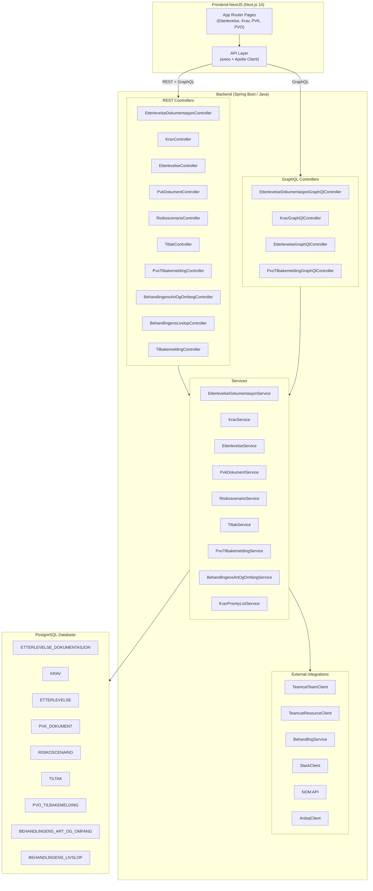

---

## System Architecture Overview

| Layer                    | Technology                                        | Role                                                                      |
| ------------------------ | ------------------------------------------------- | ------------------------------------------------------------------------- |
| **Frontend**             | Next.js 14 (App Router), TypeScript, Tailwind CSS | UI — pages, forms, navigation                                             |
| **API Client**           | axios (REST), Apollo Client (GraphQL)             | Communicates with backend                                                 |
| **Backend**              | Spring Boot 3, Java, Spring GraphQL               | REST + GraphQL API, business logic                                        |
| **Auth**                 | NAV SSO / cookie-based                            | Authenticates users via `withCredentials`                                 |
| **Database**             | PostgreSQL                                        | Stores all domain data as rows + JSONB                                    |
| **Teamcat**              | External NAV service                              | Resolves team and resource (person) data                                  |
| **Behandlingskatalogen** | External NAV service                              | Resolves `Behandling` and `DpBehandling`                                  |
| **NOM**                  | External NAV service                              | Resolves organisational units (avdelinger)                                |
| **Slack**                | External Slack API                                | Resolves Slack channels and users for varslingsadresser                   |
| **Ardoq**                | External Ardoq API                                | Resolves system metadata (`ardoqSystemIds`) for EtterlevelseDokumentasjon |

---

## Domain Model (Class Diagram)

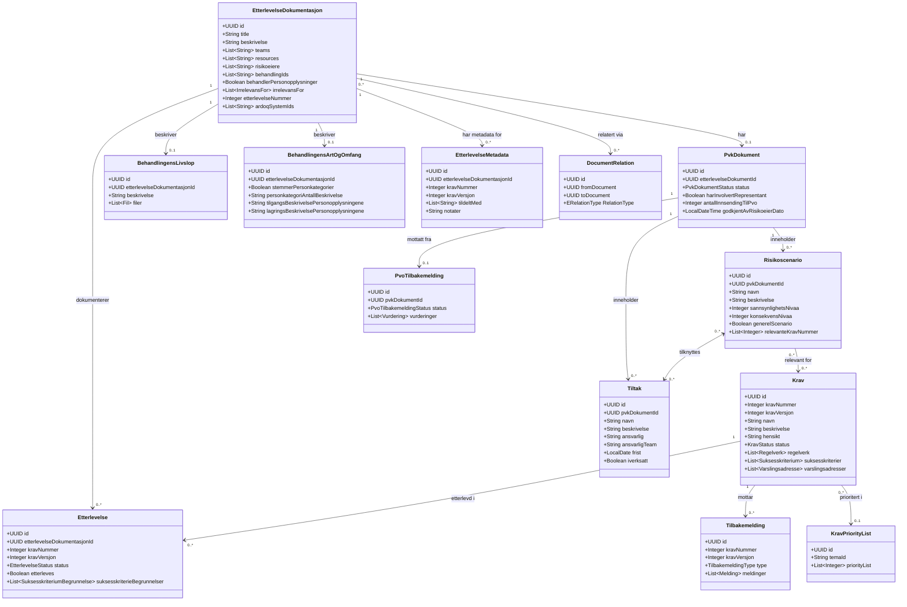

---

## API Endpoint Overview

### REST API

| Endpoint                                   | Methods                |
| ------------------------------------------ | ---------------------- |
| `/etterlevelsedokumentasjon`               | GET, POST, PUT, DELETE |
| `/krav`                                    | GET, POST, PUT, DELETE |
| `/etterlevelse`                            | GET, POST, PUT, DELETE |
| `/pvkdokument`                             | GET, POST, PUT, DELETE |
| `/risikoscenario`                          | GET, POST, PUT, DELETE |
| `/tiltak`                                  | GET, POST, PUT, DELETE |
| `/pvotilbakemelding`                       | GET, POST, PUT, DELETE |
| `/behandlingens-art-og-omfang`             | GET, POST, PUT, DELETE |
| `/behandlingenslivslop`                    | GET, POST, PUT, DELETE |
| `/tilbakemelding`                          | GET, POST, DELETE      |
| `/team`                                    | GET                    |
| `/behandling`                              | GET                    |
| `/codelist`                                | GET, POST, PUT, DELETE |
| `/melding`                                 | GET, POST, PUT, DELETE |
| `/audit`                                   | GET                    |
| `/audit/search/{searchTerm}/table/{table}` | GET                    |
| `/userinfo`                                | GET                    |
| `/nom`                                     | GET                    |

### GraphQL API (`/graphql`)

| Query                               |
| ----------------------------------- |
| `etterlevelseDokumentasjon(filter)` |
| `krav(filter)` / `kravById`         |
| `etterlevelseById`                  |
| `pvoTilbakemelding(filter)`         |

---

## EtterlevelseDokumentasjon Status State Machine

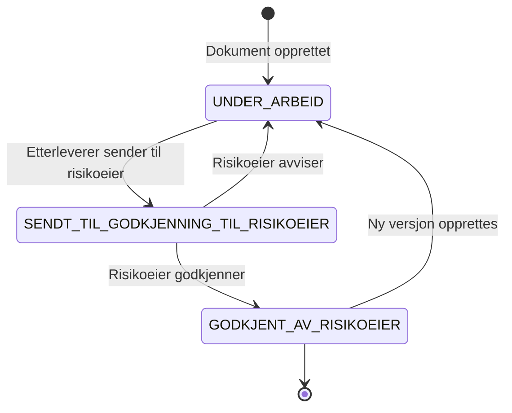

---

## PVK/PVO Status State Machine

### PvkDokument statuses

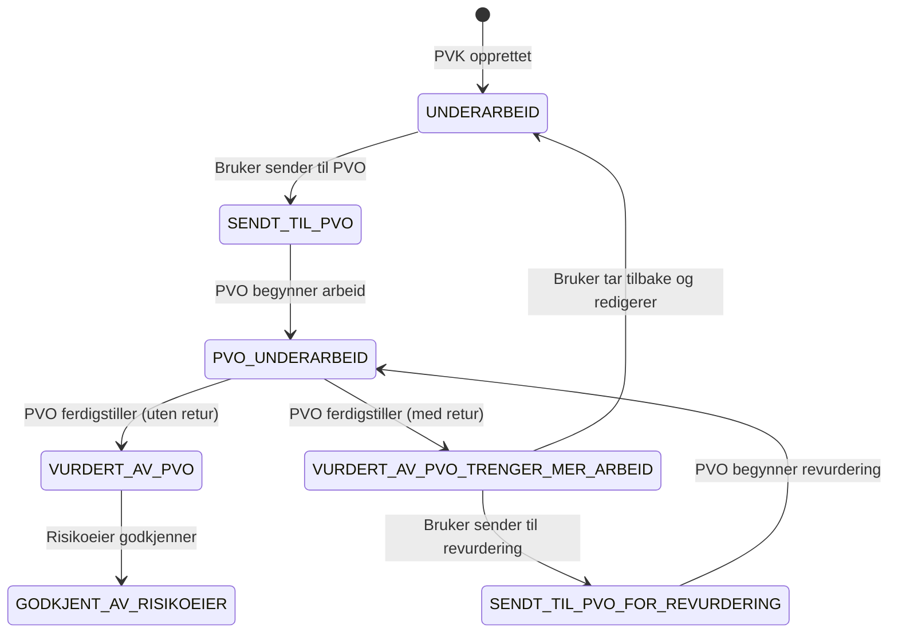

### PvoTilbakemelding statuses

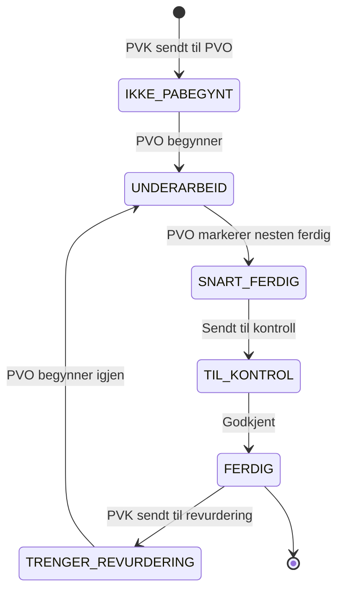

---

## Action Menu Button State Machines

The documentation page (`/dokumentasjon/:id`) renders up to three action menu buttons when conditions are met:

- **Etterlevelse** – shown when `user.isAdmin() || hasCurrentUserAccess`
- **Personvernkonsekvensvurdering (PVK)** – shown when `behandlerPersonopplysninger = true`
- **Gjenbruk** – shown when `forGjenbruk && (user.isAdmin() || hasCurrentUserAccess) && !morDokumentRelasjon` (previously dev-only, now available in all environments)

All buttons adapt their menu items based on the current user's **role** and the document's **status / tilstand**.

---

### Etterlevelse-knapp

Role is determined by `getRolle(etterlevelseDokumentasjon)`:

- `Admin` – user is system admin
- `EtterleverOgRisikoeier` – user has access AND is listed as risikoeier
- `Risikoeier` / `Personvernombud` – user is risikoeier or PVO (read-mostly)
- `Etterlever` – user has access (default)

#### State transitions

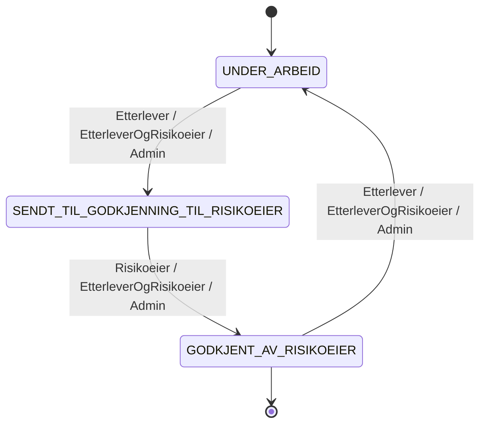

#### Menyelementer per rolle og status

| Etterlevelse-status                  | Rolle                          | Menyelementer                                                                                                |
| ------------------------------------ | ------------------------------ | ------------------------------------------------------------------------------------------------------------ |
| UNDER_ARBEID                         | Etterlever                     | Rediger dokumentegenskaper · Eksporter til Word · **Få etterlevelsen godkjent av risikoeier**                |
| UNDER_ARBEID                         | Risikoeier / Personvernombud   | Eksporter til Word                                                                                           |
| UNDER_ARBEID                         | EtterleverOgRisikoeier / Admin | Rediger dokumentegenskaper · Eksporter til Word · **Få etterlevelsen godkjent av risikoeier**                |
| SENDT_TIL_GODKJENNING_TIL_RISIKOEIER | Etterlever                     | Les innsending til risikoeier · Rediger dokumentegenskaper · Eksporter til Word                              |
| SENDT_TIL_GODKJENNING_TIL_RISIKOEIER | Risikoeier / Personvernombud   | **Godkjenn etterlevelsen** · Eksporter til Word                                                              |
| SENDT_TIL_GODKJENNING_TIL_RISIKOEIER | EtterleverOgRisikoeier / Admin | Les innsending til risikoeier · Rediger dokumentegenskaper · **Godkjenn etterlevelsen** · Eksporter til Word |
| GODKJENT_AV_RISIKOEIER               | Etterlever                     | Rediger dokumentegenskaper · **Lås opp og oppdater dokumentasjon** · Eksporter til Word                      |
| GODKJENT_AV_RISIKOEIER               | Risikoeier / Personvernombud   | Eksporter til Word                                                                                           |
| GODKJENT_AV_RISIKOEIER               | EtterleverOgRisikoeier / Admin | Rediger dokumentegenskaper · **Lås opp og oppdater dokumentasjon** · Eksporter til Word                      |

---

### PVK-knapp (PVK Tilstand)

The PVK button renders based on `EPVKTilstandStatus`, computed by `getPvkTilstand(pvkDokument, pvoTilbakemelding)`.

Role priority: `Admin` > `Personvernombud` > `EtterleverOgRisikoeier` > `Risikoeier` > `Etterlever` > `Les`

#### Tilstand flow

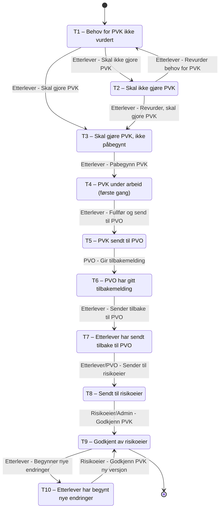

#### Primær knapp per rolle og tilstand

Bold = action-triggering button. Italic = read-only navigation only.

| Tilstand                           | Etterlever                 | Personvernombud        | Risikoeier               | EtterleverOgRisikoeier     | Admin                      |
| ---------------------------------- | -------------------------- | ---------------------- | ------------------------ | -------------------------- | -------------------------- |
| T1 – Behov ikke vurdert            | **Vurder behov for PVK**   | _navigasjon_           | _navigasjon_             | **Vurder behov for PVK**   | **Vurder behov for PVK**   |
| T2 – Skal ikke gjøre PVK           | **Revurder behov for PVK** | _navigasjon_           | _navigasjon_             | **Revurder behov for PVK** | **Revurder behov for PVK** |
| T3 – Skal gjøre PVK, ikke påbegynt | **Påbegynn PVK**           | _navigasjon_           | _navigasjon_             | **Påbegynn PVK**           | **Påbegynn PVK**           |
| T4 – PVK under arbeid              | **Fullfør PVK**            | _Les PVK_              | _Les PVK_                | **Fullfør PVK**            | **Fullfør PVK**            |
| T5 – PVK sendt til PVO             | _Les PVK_                  | **Vurder PVK**         | _Les PVK_                | _Les PVK_                  | **Vurder PVK**             |
| T6 – PVO har gitt tilbakemelding   | _Les PVOs tilbakemelding_  | _Les PVK_              | _Les PVK_                | _Les PVOs tilbakemelding_  | _Les PVOs tilbakemelding_  |
| T7 – Sendt tilbake til PVO         | _Les PVK_                  | **Vurder PVK**         | _Les PVK_                | _Les PVK_                  | **Vurder PVK**             |
| T8 – Sendt til risikoeier          | _Les PVK_                  | _Les PVK_              | **Godkjenn PVK**         | **Godkjenn PVK**           | **Godkjenn PVK**           |
| T9 – Godkjent av risikoeier        | **Les og oppdater PVK**    | _Les PVK_              | _Les PVK_                | _Les og oppdater PVK_      | _Les og oppdater PVK_      |
| T10 – Ny versjon under arbeid      | **Fullfør PVK**            | **Vurder PVK (ny v.)** | **Godkjenn PVK (ny v.)** | **Fullfør PVK**            | **Fullfør PVK**            |

---

## Dashboard Traffic Light Colors

The department dashboard (`/dashboard/:avdeling`, `AvdelingDetailPage.tsx`) uses colored dots
(`TrafficDot`) to give a quick visual indication of status in the **Etterlevelse** and
**Digital PVK** tabs. The tema dashboard (`/dashboard/tema/:temaCode`, `TemaDetailPage.tsx`) reuses
the same dot and "Oppfylt" popover logic in its **Vis etterlevelsesdokumenter** tab. Both
`TrafficDot`, `getKravTrafficColor` and `OppfyltCell` live in the shared `DashboardTableCells.tsx`
component so the visual rules described below apply identically on both pages.

### Etterlevelse tab – "Antall krav ferdig utfylt"

The dot color is based on the percentage of krav marked as ferdig utfylt
(`antallOppfyltKrav` / `antallKrav`), via `getKravTrafficColor`:

| Condition     | Color              | Meaning                                      |
| ------------- | ------------------ | -------------------------------------------- |
| `total === 0` | Grey (`#C6C2BF`)   | No krav exist yet for the document           |
| `pct >= 100`  | Green (`#06893A`)  | All krav are ferdig utfylt                   |
| `pct >= 50`   | Orange (`#E67E22`) | At least half of the krav are ferdig utfylt  |
| `pct < 50`    | Red (`#C30000`)    | Less than half of the krav are ferdig utfylt |

### Etterlevelse tab – "Oppfylt"

This column (`OppfyltCell`) shows a percentage button that, when clicked, opens a popover with
more detail. The percentage (`oppfyltKravProsent`) is calculated only from krav that the etterlever
has already marked as **ferdig utfylt** — krav that are not yet ferdig utfylt are not counted.

- `antallSuksesskriterierOppfylt` — number of suksesskriterier assessed as oppfylt, shown in green (`#005B4B`)
- `antallSuksesskriterierIkkeOppfylt` — number of suksesskriterier assessed as ikke oppfylt, shown in red (`#C30000`)
- Suksesskriterier assessed as "ikke relevant" are excluded from both counts and from the percentage
- The percentage = oppfylt / (oppfylt + ikke oppfylt) among ferdig utfylt krav
- If no krav are ferdig utfylt yet (`totSuksess === 0`), the button shows `-` instead of a percentage

### Digital PVK tab – "Høy risiko før tiltak", "Høy risiko etter tiltak", "Tiltaksfrist passert"

These three columns use a simpler rule: a red dot (`#C30000`) is shown together with the count
whenever the count is greater than 0. If the count is 0 (or not applicable), no dot is shown and
a dash (`-`) is displayed instead.

| Column                  | Dot shown when                   | Meaning                                                          |
| ----------------------- | -------------------------------- | ---------------------------------------------------------------- |
| Høy risiko før tiltak   | `antallHoyRisikoscenario > 0`    | There are risikoscenarioer with high risk before tiltak          |
| Høy risiko etter tiltak | `antallHoyRisikoEtterTiltak > 0` | There are risikoscenarioer with high risk remaining after tiltak |
| Tiltaksfrist passert    | `antallTiltakFristPassert > 0`   | There are tiltak whose deadline has passed                       |

Unlike the "Antall krav ferdig utfylt" column, these columns do not use graded colors (green/orange/red) —
they only ever show red or nothing, since any non-zero count represents a risk that needs attention.

---

## Dashboard Vis Figurer – Status & Count Logic

The **"Vis figurer"** view is available on:

- `/dashboard` – all avdelinger (`DashboardPage.tsx`)
- `/dashboard/:avdelingId` (e.g. `/dashboard/arbeids_og_velferdsdirektor`) – single avdeling (`AvdelingDetailPage.tsx`)
- `/dashboard/tema` – all tema (`TemaDashboardPage.tsx`)
- `/dashboard/tema/:temaCode` (e.g. `/dashboard/tema/EL_KOM`) – single tema (`TemaDetailPage.tsx`)

All four pages fetch pre-aggregated counts from the backend (`DashboardController` /
`DashboardService.java`) and render them as bar charts in `DashboardBarCard.tsx`, using the colors
defined in `chartUtils.ts`. The four figures shown are described below.

### 1. Etterlevelsesdokumenter

Based on `EtterlevelseDokumentasjonStatus` on each etterlevelsesdokumentasjon, with one extra split:

| Status shown          | Source                                                                         |
| --------------------- | ------------------------------------------------------------------------------ |
| Ikke påbegynt         | `UNDER_ARBEID` **and** the document has no etterlevelser (kravbesvarelser) yet |
| Under arbeid          | `UNDER_ARBEID` **and** the document has at least one etterlevelse              |
| Sendt til godkjenning | `SENDT_TIL_GODKJENNING_TIL_RISIKOEIER`                                         |
| Godkjent              | `GODKJENT_AV_RISIKOEIER`                                                       |

So "Ikke påbegynt" vs. "Under arbeid" is not a separate backend status — both map to the same
`UNDER_ARBEID` enum value, and are only distinguished by whether any etterlevelse exists for the
document. "Etterlevelse" here means a saved krav-answer record (`EtterlevelseService.save()` has
been called for at least one krav), not a filled-in suksesskriterium — a document can have an
etterlevelse record before any `SuksesskriterieBegrunnelse` has been answered.

### 2. Suksesskriterier (etterlevelseskrav)

Counts every `SuksesskriterieBegrunnelse` on every etterlevelse belonging to an **aktivt krav**
(only krav versions that are currently active are included), grouped by `SuksesskriterieStatus`:
Ikke påbegynt, Under arbeid, Oppfylt, Ikke oppfylt, Ikke relevant.

Unlike the other three figures, this one is shown as **percentages**, not counts. Each percentage
is `antall / total suksesskriterier * 100`, rounded to the nearest integer. Importantly, **all**
statuses — including "Ikke relevant" — are part of the same total, so the five percentages always
sum to (approximately) 100%. This differs from the "Oppfylt" column in the avdeling table (see
[Dashboard Traffic Light Colors](#dashboard-traffic-light-colors) above), where "ikke relevant" is
excluded from the denominator.

### 3. Vurdere behov for PVK

Only documents that are **relevant for personopplysninger** are included (documents where
`irrelevansFor` contains `PERSONOPPLYSNINGER` are excluded entirely from this figure). For each
remaining document, the first `PvkDokument` linked to it (if any) is inspected:

| Status shown              | Condition                                                                                 |
| ------------------------- | ----------------------------------------------------------------------------------------- |
| Ikke vurdert behov        | No `PvkDokument` exists yet, or its `pvkVurdering` is `null`/`UNDEFINED`                  |
| Skal ikke gjennomføre PVK | `pvkVurdering == SKAL_IKKE_UTFORE`                                                        |
| Skal gjennomføre PVK      | `pvkVurdering == SKAL_UTFORE` (the "not yet started" bucket that feeds into figure 4)     |
| PVK i Word                | `pvkVurdering == ALLEREDE_UTFORT` (PVK already done outside the tool, in a Word document) |

### 4. Digital PVK status

Only counts documents from figure 3 where the PVK vurdering resulted in `SKAL_UTFORE` (i.e. a
digital PVK is actually required) — this excludes "PVK i Word" and "Skal ikke gjennomføre PVK". For
those documents, the backend first decides **whether the PVK documentation has actually been
started** (`hasPvkStarted`), then maps the `PvkDokumentStatus`:

**Step 1 – has the PVK been started?** `hasPvkStarted` is `true` if any of the following is true:

- At least one `Risikoscenario` has been registered for the PVK, **or**
- There is a message to PVO for the current innsending (`antallInnsendingTilPvo`) with non-empty `merknadTilPvo`, **or**
- Representative involvement has been filled in (`harInvolvertRepresentant`, `harDatabehandlerRepresentantInvolvering`,
  or either involvement description is non-empty)

If none of these are true, the document is counted as **Ikke påbegynt**, regardless of its formal
`PvkDokumentStatus` value.

**Step 2 – if started, map `PvkDokumentStatus` to a figure bucket:**

| Status shown           | `PvkDokumentStatus` values                                                        |
| ---------------------- | --------------------------------------------------------------------------------- |
| Til behandling hos PVO | `SENDT_TIL_PVO`, `PVO_UNDERARBEID`, `SENDT_TIL_PVO_FOR_REVURDERING`               |
| Tilbakemelding fra PVO | `VURDERT_AV_PVO`, `VURDERT_AV_PVO_TRENGER_MER_ARBEID`                             |
| Godkjent av risikoeier | `GODKJENT_AV_RISIKOEIER`                                                          |
| Under arbeid           | Everything else (`UNDERARBEID`, `TRENGER_GODKJENNING`, ...) — the fallback bucket |

### Tema dashboards (`/dashboard/tema`, `/dashboard/tema/:temaCode`)

The tema-level dashboards apply the exact same counting rules as above, but instead of scoping the
input documents by avdeling, they scope by tema (and, on the detail page, additionally by krav
belonging to that tema code, e.g. `EL_KOM`). The same `DashboardBarCard` component is reused to
render the figures, so the status definitions and edge cases described above apply identically.

### 5. Vis etterlevelsesdokumenter tab (tema detail page only)

In addition to the "Vis figurer" and "Vis nøkkeltall" tabs, the "Overordnet for alle X krav"
section on `TemaDetailPage.tsx` has a third tab, **Vis etterlevelsesdokumenter**, listing every
etterlevelsesdokument relevant for the selected tema (and current avdeling/seksjon/enhet/team
filters) in a table, reusing the same columns and traffic-light/oppfylt logic as the
**Etterlevelse** tab on the avdeling dashboard (see
[Dashboard Traffic Light Colors](#dashboard-traffic-light-colors)):

- **Etterlevelsesdokument** — link to the document
- **Antall krav ferdig utfylt** — `antallOppfyltKrav` / `antallKrav`, with a `TrafficDot`
- **Oppfylt** — `OppfyltCell` popover, as described above
- **Risikoeier**, **Team**, **Person**

The data is fetched from a dedicated backend endpoint, `GET /dashboard/table/tema/{temaCode}`
(`DashboardService.getDashboardTableByTema`), which filters etterlevelsesdokumenter the same way as
the "Vis figurer"/"Vis nøkkeltall" tema stats, restricts the active krav list to those belonging to
the tema's lov codes, and — unlike the avdeling table — only returns documents that have at least
one relevant krav for the tema (`antallKrav > 0`). Internally it shares its row-building logic with
`getDashboardTable` (avdeling) via a private `buildDashboardTable` helper, so PVK/risiko fields are
computed identically; only the input document list and active krav list differ.

---

## Sequence Diagrams

### 1. User loads an Etterlevelse documentation page

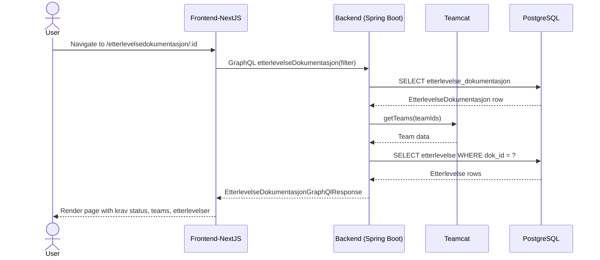

### 2. User submits a PVK document to PVO

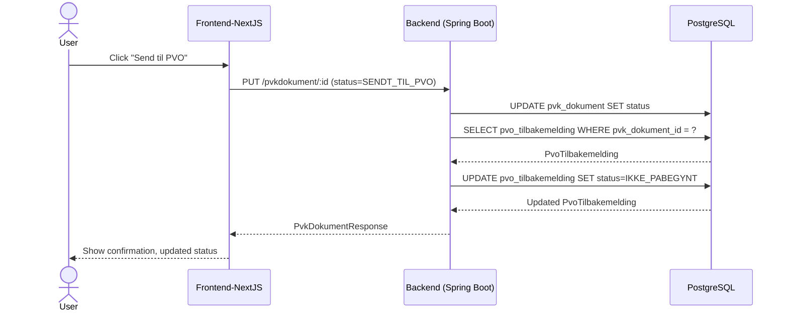

### 3. PVO registers feedback (Tilbakemelding)

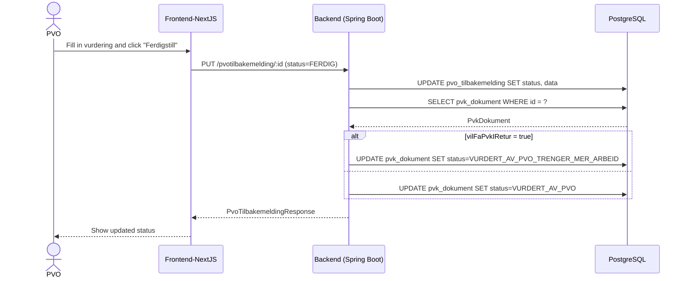

### 4. User creates a Risikoscenario linked to a Krav

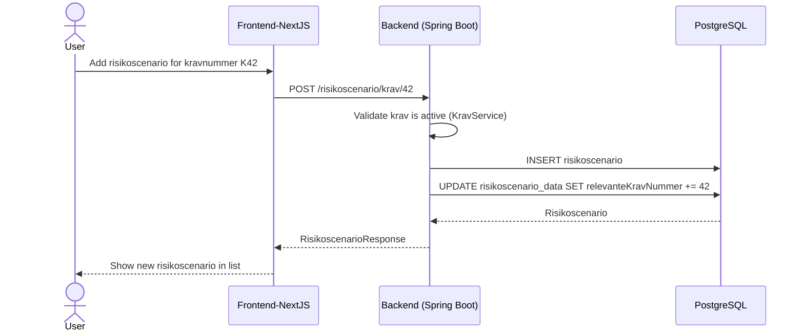

### 5. Risikoeier approves PVK

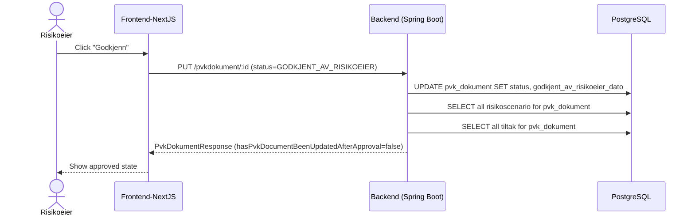
