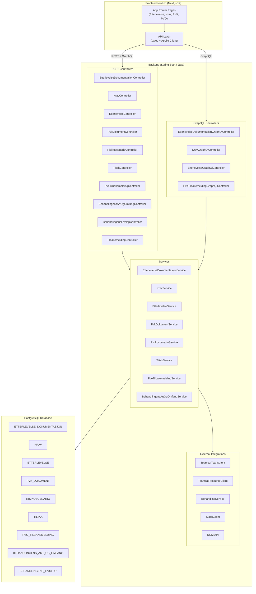
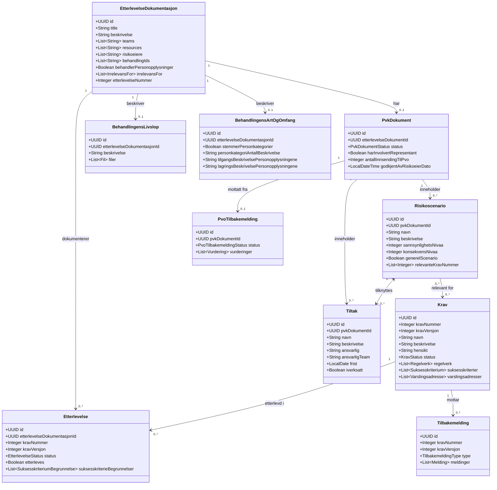
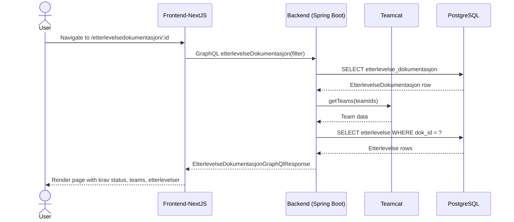
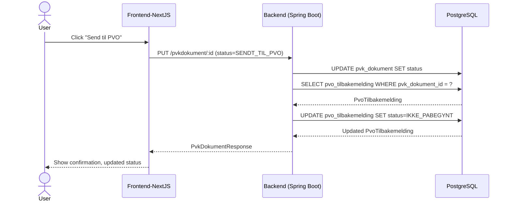
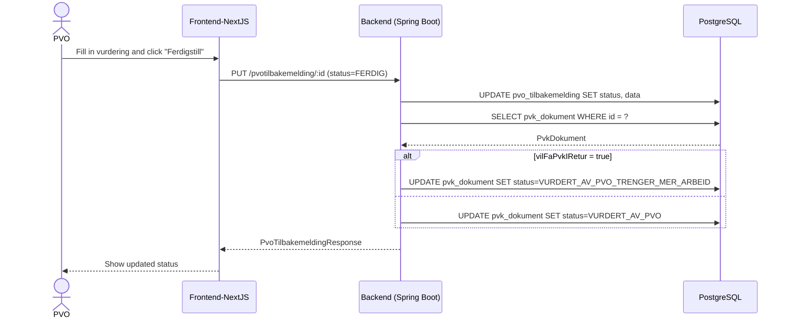
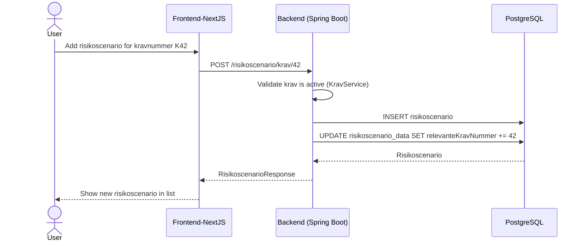
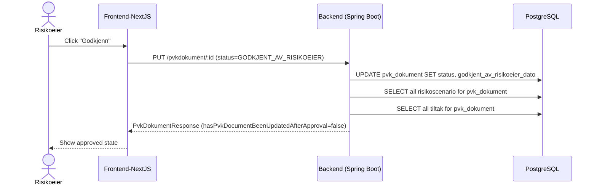

# Etterlevelse – UML Architecture & Domain Model

**Date created:** 26 March 2026

---

## How to view Mermaid diagrams in VS Code

### Install the extension

1. Open VS Code
2. Press `Ctrl+Shift+X` (Windows) or `Cmd+Shift+X` (Mac) to open the Extensions panel
3. Search for **"Mermaid"**
4. Install **"Markdown Preview Mermaid Support"** by Matt Bierner
   - Extension ID: `bierner.markdown-mermaid`

### Open and preview this file

| OS          | Steps                                                                                                              |
| ----------- | ------------------------------------------------------------------------------------------------------------------ |
| **Mac**     | Open this file → press `Cmd+Shift+V` to open Markdown Preview, or right-click the tab and choose **Open Preview**  |
| **Windows** | Open this file → press `Ctrl+Shift+V` to open Markdown Preview, or right-click the tab and choose **Open Preview** |

Alternatively, both platforms: click the **split preview** icon (📄 with magnifier) in the top-right corner of the editor when this file is open.

---

## System Architecture

---

## Domain Model (Class Diagram)

---

## API Endpoint Overview

### REST API

| Endpoint                       | Methods                |
| ------------------------------ | ---------------------- |
| `/etterlevelsedokumentasjon`   | GET, POST, PUT, DELETE |
| `/krav`                        | GET, POST, PUT, DELETE |
| `/etterlevelse`                | GET, POST, PUT, DELETE |
| `/pvkdokument`                 | GET, POST, PUT, DELETE |
| `/risikoscenario`              | GET, POST, PUT, DELETE |
| `/tiltak`                      | GET, POST, PUT, DELETE |
| `/pvotilbakemelding`           | GET, POST, PUT, DELETE |
| `/behandlingens-art-og-omfang` | GET, POST, PUT, DELETE |
| `/behandlingenslivslop`        | GET, POST, PUT, DELETE |
| `/tilbakemelding`              | GET, POST, DELETE      |
| `/team`                        | GET                    |
| `/behandling`                  | GET                    |
| `/codelist`                    | GET, POST, PUT, DELETE |
| `/melding`                     | GET, POST, PUT, DELETE |
| `/audit`                       | GET                    |
| `/userinfo`                    | GET                    |
| `/nom`                         | GET                    |

### GraphQL API (`/graphql`)

| Query                               |
| ----------------------------------- |
| `etterlevelseDokumentasjon(filter)` |
| `krav(filter)` / `kravById`         |
| `etterlevelseById`                  |
| `pvoTilbakemelding(filter)`         |

---

## Sequence Diagrams

### 1. User loads an Etterlevelse documentation page

### 2. User submits a PVK document to PVO

### 3. PVO registers feedback (Tilbakemelding)

### 4. User creates a Risikoscenario linked to a Krav

### 5. Risikoeier approves PVK

